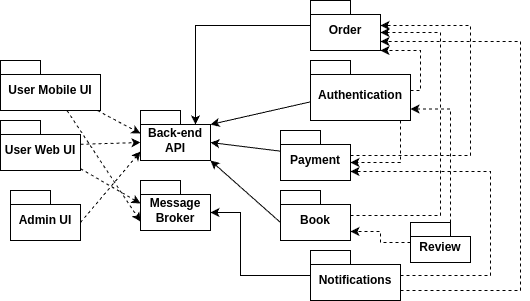
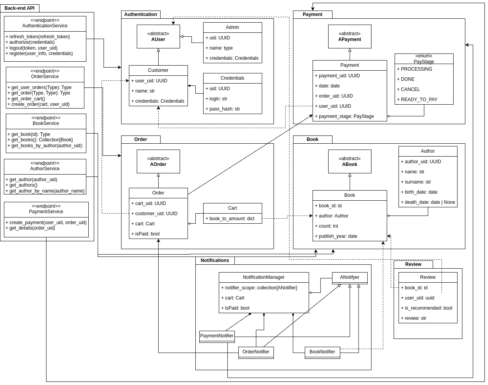

# **Общие сведения о системе**

"Магазин книг" — это интернет-платформа для продажи книг, которая включает веб-интерфейс для пользователей, систему учета заказов, а также механизмы взаимодействия с партнерами через веб-сервисы и другие интерфейсы. В системе предусмотрены возможности для добавления книг в корзину, оформления заказов, поиска книг, оставления отзывов и оплаты заказов. Пользователи могут создавать учетные записи, что позволяет сохранить их данные для будущих покупок.

Основные функции системы:
- Добавление и удаление книг из корзины.
- Оформление заказа с оплатой через кредитную карту или по счету.
- Поиск книг по различным критериям (по заголовку, автору, категории).
- Оставление отзывов и их модерация.
- Поддержка партнерских мини-каталогов.
- Возможности для сторонних продавцов добавлять свои книги в каталог.
- Масштабируемость системы для обработки большего числа пользователей и запросов.

---

## **Architectural Drivers**

Основные факторы, определяющие архитектуру:
- **Масштабируемость**: система должна поддерживать быстрое увеличение числа пользователей, заказов и поисковых запросов.
- **Гибкость и расширяемость**: система должна легко интегрироваться с внешними интерфейсами (например, через API для партнеров или сторонних продавцов).
- **Безопасность**: хранение чувствительных данных пользователей (например, паролей и банковских данных).
- **Производительность**: обеспечение быстрой обработки заказов и поиска, особенно при большом количестве пользователей.
- **Управляемость**: система должна поддерживать эффективную модерацию отзывов и управление контентом.

---

## **Роли и случаи использования**

### Роли:
- **Пользователь**: Может искать книги, добавлять их в корзину, оформлять заказы, оставлять отзывы.
- **Администратор**: Управляет отзывами, каталогом книг, пользователями и заказами.
- **Продавец**: Может добавлять книги в каталог для продажи.
- **Партнер**: Получает доступ к мини-каталогу для встраивания на внешние сайты.

### Основные случаи использования:
- Пользователь может **зарегистрироваться** и **войти** в систему.
- Пользователь может **искать книги** по разным параметрам.
- Пользователь может **добавлять книги в корзину** и **оформить заказ**.
- Администратор может **модерировать отзывы**.
- Продавец может **добавлять книги в каталог**.
- Партнер может **встраивать мини-каталог** на свой сайт.

---

## **Композиция (Диаграмма компонентов и описание)**

### Компоненты:

1. **User Web UI**:
   - Веб-интерфейс для пользователей.
   - Позволяет искать книги, добавлять их в корзину, оформлять заказы и оставлять отзывы.

2. **User Mobile UI**:
   - Мобильное приложение для пользователей.
   - Предоставляет аналогичные возможности, включая просмотр каталога, оформление заказов и управление корзиной.

3. **Admin UI**:
   - Панель управления для администраторов.
   - Используется для управления книгами, отзывами и пользователями.

4. **Back-end API**:
   - Центральный компонент, связывающий все пакеты.
   - Обеспечивает взаимодействие между интерфейсами пользователей, каталогом книг, платежной системой, заказами и отзывами.

5. **Authentication**:
   - Управление регистрацией и аутентификацией пользователей.
   - Обеспечивает безопасность данных через токены и пароли.

6. **Book**:
   - Хранение информации о книгах, включая авторов, описания, публикации.
   - Поддержка фильтрации и поиска.

7. **Order**:
   - Управление заказами пользователей.
   - Содержит информацию о корзине, статусе заказа и платеже.

8. **Payment**:
   - Обработка платежей.
   - Интеграция с внешними платежными сервисами для обработки транзакций.

9. **Review**:
   - Управление отзывами пользователей.
   - Включает функционал модерирования и отображения отзывов в каталоге.

10. **Notifications**:
    - Система отправки уведомлений.
    - Отправляет пользователям уведомления о статусах заказов и платежей.

11. **Message Broker**:
    - Асинхронная система обмена сообщениями между компонентами.
    - Используется для обработки событий, таких как обновления статусов заказов, уведомления и обработка платежей.

---

### Описание:
Эта система состоит из взаимосвязанных компонентов, которые обеспечивают полный цикл взаимодействия пользователя с онлайн-магазином книг. Фронтенд-интерфейсы (веб и мобильные) работают через Back-end API, который координирует действия между функциональными модулями, такими как каталог книг, заказы, платежи и отзывы. Компонент уведомлений обеспечивает информирование пользователей о ключевых событиях, а брокер сообщений обрабатывает асинхронные задачи для повышения производительности.

---

## **Логическая структура (Диаграмма классов и описание)**

### Классы:
- **Authentication**:
  - **AUser** (Абстрактный пользователь): Общий базовый класс для всех пользователей.
  - **Admin**: Администратор, управляющий системой.
  - **Customer**: Клиент, который делает заказы.
  - **Credentials**: Содержит данные для авторизации, включая логин и хэш пароля.

- **Book**:
  - **ABook** (Абстрактная книга): Общий базовый класс.
  - **Book**: Конкретная реализация книги с атрибутами, такими как автор, год публикации и количество.
  - **Author**: Автор книги с информацией о его имени, фамилии, датах рождения и смерти.

- **Order**:
  - **AOrder** (Абстрактный заказ): Общий базовый класс.
  - **Order**: Конкретная реализация заказа с данными о пользователе, корзине и статусе оплаты.
  - **Cart**: Корзина с книгами и их количеством.

- **Payment**:
  - **APayment** (Абстрактный платеж): Общий базовый класс.
  - **Payment**: Платеж с привязкой к заказу и пользователю.
  - **PayStage** (Enum): Статусы платежа, включая "PROCESSING", "DONE", "CANCEL", "READY_TO_PAY".

- **Notifications**:
  - **NotificationManager**: Менеджер уведомлений.
  - **ANotifier**: Абстрактный класс для различных уведомлений.
  - **PaymentNotifier**: Уведомление о платеже.
  - **OrderNotifier**: Уведомление о заказе.
  - **BookNotifier**: Уведомление о книге.

- **Review**: Отзыв на книгу, содержащий текст, флаг "рекомендуется" и оценку.

### Описание:
- **Authentication**:
  Управляет авторизацией и аутентификацией пользователей (администраторов и клиентов) через сервисы: `register`, `authorize`, `logout`, `refresh_token`.
  
- **Book**:
  Основная сущность для управления каталогом книг. Связана с заказами, отзывами и авторами. Позволяет просматривать и фильтровать книги.

- **Order**:
  Хранит данные о заказах, включая книги, корзину пользователя и статус оплаты. Реализует интерфейсы для получения заказов пользователя и управления корзиной.

- **Payment**:
  Отвечает за процесс оплаты заказов, поддерживает разные статусы платежей и связь с заказами.

- **Notifications**:
  Управляет уведомлениями для пользователей. Реализует механизм отправки уведомлений для событий, связанных с платежами, заказами и книгами.

- **Review**:
  Позволяет клиентам оставлять отзывы о книгах. Отзывы связаны с пользователями и книгами.

- **Admin**:
  Отвечает за управление каталогом книг, пользователями и модерацию отзывов.
